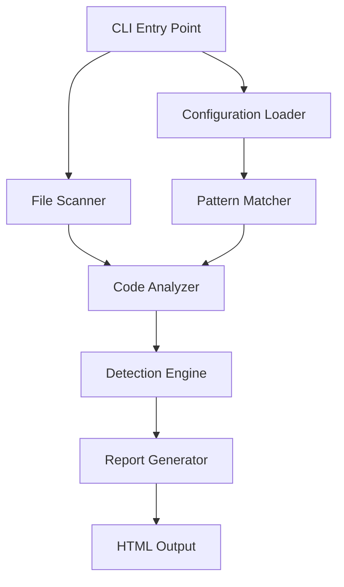
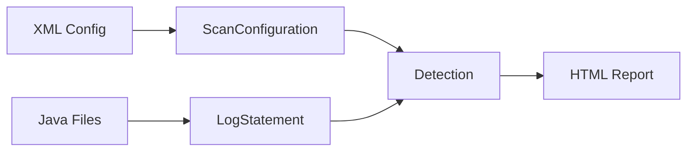

# Design Document

## Overview

The Sensitive Data Scanner is a command-line Java utility built with Maven that analyzes Java source code to detect potential sensitive information being logged. The tool uses a configurable XML-based keyword system supporting both plain text and regex patterns. It generates an HTML report detailing all findings with file locations, line numbers, matched keywords, and the actual log statements.

The architecture follows a pipeline pattern: Configuration Loading → File Discovery → Code Analysis → Detection → Report Generation.

## Architecture

### High-Level Architecture



### Component Interaction Flow

1. **Initialization Phase**: Parse command-line arguments, load XML configuration
2. **Discovery Phase**: Recursively find all .java files in the target directory
3. **Analysis Phase**: Parse each Java file line-by-line, identify log statements
4. **Detection Phase**: Match sensitive keywords/patterns against variables and method calls in log statements
5. **Reporting Phase**: Aggregate findings and generate HTML report

## Components and Interfaces

### 1. Main Application Entry Point

**Class**: `SensitiveDataScannerApp`

**Responsibilities**:
- Parse command-line arguments (folder path, config file path, optional output path)
- Orchestrate the scanning workflow
- Handle top-level error handling and user feedback

**Interface**:
```java
public class SensitiveDataScannerApp {
    public static void main(String[] args);
    private void validateArguments(String[] args);
    private void executeScan(String folderPath, String configPath, String outputPath);
}
```

### 2. Configuration Loader

**Class**: `ConfigurationLoader`

**Responsibilities**:
- Parse XML configuration file
- Extract keywords and regex patterns
- Validate configuration structure

**Interface**:
```java
public class ConfigurationLoader {
    public ScanConfiguration loadConfiguration(String configFilePath) throws ConfigurationException;
    private List<KeywordPattern> parseKeywords(Document xmlDoc);
    private List<KeywordPattern> parseSensitiveObjectTypes(Document xmlDoc);
}
```

**Class**: `ScanConfiguration`

**Data Model**:
```java
public class ScanConfiguration {
    private List<KeywordPattern> patterns;
    private List<KeywordPattern> sensitiveObjectTypes;
    
    public List<KeywordPattern> getPatterns();
    public List<KeywordPattern> getSensitiveObjectTypes();
}
```

**Class**: `KeywordPattern`

**Data Model**:
```java
public class KeywordPattern {
    private String keyword;
    private boolean isRegex;
    private Pattern compiledPattern; // null if not regex
    
    public boolean matches(String text);
}
```

**XML Configuration Format**:
```xml
<?xml version="1.0" encoding="UTF-8"?>
<scan-configuration>
    <keywords>
        <keyword type="plain">ssn</keyword>
        <keyword type="plain">socialSecurity</keyword>
        <keyword type="plain">debitCard</keyword>
        <keyword type="plain">pin</keyword>
        <keyword type="plain">dateOfBirth</keyword>
        <keyword type="plain">dob</keyword>
        <keyword type="regex">.*password.*</keyword>
        <keyword type="regex">credit[Cc]ard.*</keyword>
    </keywords>
    <sensitive-object-types>
        <object-type type="plain">request</object-type>
        <object-type type="plain">response</object-type>
        <object-type type="plain">httpResponse</object-type>
        <object-type type="plain">apiResponse</object-type>
        <object-type type="plain">requestBody</object-type>
        <object-type type="plain">responseBody</object-type>
        <object-type type="regex">.*Request</object-type>
        <object-type type="regex">.*Response</object-type>
    </sensitive-object-types>
</scan-configuration>
```

### 3. File Scanner

**Class**: `JavaFileScanner`

**Responsibilities**:
- Recursively traverse directory structure
- Identify .java files
- Return list of file paths for analysis

**Interface**:
```java
public class JavaFileScanner {
    public List<Path> scanDirectory(String rootPath) throws IOException;
    private boolean isJavaFile(Path path);
}
```

### 4. Code Analyzer

**Class**: `LogStatementAnalyzer`

**Responsibilities**:
- Read Java source files line by line
- Identify lines containing logging statements
- Extract complete log statements (handle multi-line)
- Track StringBuilder/StringBuffer variables and their append operations
- Filter out method signatures and parameter definitions

**Interface**:
```java
public class LogStatementAnalyzer {
    public List<LogStatement> analyzeFile(Path filePath) throws IOException;
    private boolean isLogStatement(String line);
    private boolean isMethodSignature(String line);
    private String extractCompleteStatement(BufferedReader reader, String firstLine, int startLine);
    private Map<String, List<String>> trackStringBuilders(List<String> fileLines);
}
```

**Class**: `LogStatement`

**Data Model**:
```java
public class LogStatement {
    private String fileName;
    private int lineNumber;
    private String statement;
    private Map<String, List<String>> relatedBuilderAppends; // For tracking multi-line StringBuilder/StringBuffer
    
    // Getters
}
```

**Logging Pattern Detection**:
- Regex patterns to identify: `logger\.`, `log\.`, `LOGGER\.`, `LOG\.`
- Common methods: `info`, `debug`, `warn`, `error`, `trace`, `fatal`

### 5. Detection Engine

**Class**: `SensitiveDataDetector`

**Responsibilities**:
- Analyze log statements for sensitive data patterns
- Distinguish between string literals and variables
- Detect various logging patterns (concatenation, StringBuilder, String.join)
- Match keywords against variable names and method calls

**Interface**:
```java
public class SensitiveDataDetector {
    public List<Detection> detectSensitiveData(LogStatement logStatement, ScanConfiguration config);
    private boolean isStringLiteral(String token);
    private List<String> extractVariables(String statement);
    private List<String> extractMethodCalls(String statement);
    private boolean matchesKeyword(String identifier, KeywordPattern pattern);
    private List<String> extractObjectReferences(String statement);
    private boolean isSensitiveObjectType(String identifier, List<KeywordPattern> objectTypes);
}
```

**Class**: `Detection`

**Data Model**:
```java
public class Detection {
    private String fileName;
    private int lineNumber;
    private String matchedKeyword;
    private String logStatement;
    
    // Getters
}
```

**Detection Logic**:

1. **Variable Detection**: 
   - Pattern: `\b([a-zA-Z_][a-zA-Z0-9_]*)\b` (outside of string literals)
   - Match variable names against keywords

2. **Method Call Detection**:
   - Pattern: `\b([a-zA-Z_][a-zA-Z0-9_]*)\s*\(` or `\.([a-zA-Z_][a-zA-Z0-9_]*)\s*\(`
   - Match method names against keywords (e.g., `getSSN()`, `card.getNumber()`)

3. **StringBuilder/StringBuffer Pattern (Single-line)**:
   - Pattern: `(StringBuilder|StringBuffer).*\.append\s*\(([^)]+)\)`
   - Extract content within append() and check for variables

4. **StringBuilder/StringBuffer Pattern (Multi-line)**:
   - Track StringBuilder/StringBuffer variable declarations
   - Collect all append() operations on the same variable across multiple lines
   - When the builder is logged (e.g., `logger.info(sb.toString())`), check all collected append() calls for sensitive data
   - Pattern for tracking: `(StringBuilder|StringBuffer)\s+([a-zA-Z_][a-zA-Z0-9_]*)\s*=`
   - Pattern for append: `([a-zA-Z_][a-zA-Z0-9_]*)\.append\s*\(([^)]+)\)`

5. **String.join/StringJoiner Pattern**:
   - Pattern: `String\.join\s*\([^,]+,\s*(.+)\)` or `StringJoiner.*\.add\s*\(([^)]+)\)`
   - Extract variables being joined

6. **String Literal Filtering**:
   - Identify content within double quotes: `"[^"]*"`
   - Exclude these regions from variable detection

7. **Sensitive Object Type Detection**:
   - Extract all variable references and object identifiers from log statements
   - Match against configured sensitive object types (e.g., request, response, httpResponse)
   - Detect direct logging: `logger.info(request)`, `logger.info(response)`
   - Detect method calls on sensitive objects: `logger.info(request.getBody())`, `logger.info(response.toString())`, `logger.info(httpResponse.body())`
   - Pattern for object references: `\b([a-zA-Z_][a-zA-Z0-9_]*)\b` (outside string literals)
   - Pattern for method calls on objects: `([a-zA-Z_][a-zA-Z0-9_]*)\.([a-zA-Z_][a-zA-Z0-9_]*)\s*\(`

### 6. Report Generator

**Class**: `HtmlReportGenerator`

**Responsibilities**:
- Aggregate all detections
- Generate formatted HTML report
- Include summary statistics
- Save report to file with timestamp

**Interface**:
```java
public class HtmlReportGenerator {
    public void generateReport(List<Detection> detections, String outputPath, ScanStatistics stats) throws IOException;
    private String buildHtmlContent(List<Detection> detections, ScanStatistics stats);
    private String generateTimestamp();
}
```

**Class**: `ScanStatistics`

**Data Model**:
```java
public class ScanStatistics {
    private int totalFilesScanned;
    private int totalDetections;
    private long scanDurationMs;
    
    // Getters and setters
}
```

**HTML Report Structure**:
```html
<!DOCTYPE html>
<html>
<head>
    <title>Sensitive Data Scan Report</title>
    <style>
        /* CSS for table formatting, highlighting */
    </style>
</head>
<body>
    <h1>Sensitive Data Scan Report</h1>
    <div class="summary">
        <p>Scan Date: [timestamp]</p>
        <p>Total Files Scanned: [count]</p>
        <p>Total Detections: [count]</p>
        <p>Scan Duration: [time]</p>
    </div>
    <table>
        <thead>
            <tr>
                <th>File Name</th>
                <th>Line Number</th>
                <th>Matched Keyword</th>
                <th>Log Statement</th>
            </tr>
        </thead>
        <tbody>
            <!-- Detection rows -->
        </tbody>
    </table>
</body>
</html>
```

## Data Models

### Core Data Flow



### Key Data Structures

1. **ScanConfiguration**: Holds all keyword patterns from XML
2. **KeywordPattern**: Individual keyword with type (plain/regex) and compiled pattern
3. **LogStatement**: Represents a single log statement with location info
4. **Detection**: Represents a finding with all relevant details
5. **ScanStatistics**: Aggregated metrics for the report

## Error Handling

### Configuration Errors

- **Invalid XML**: Catch `SAXException`, display clear error message with line number if available
- **Missing Config File**: Check file existence before parsing, provide helpful error message
- **Invalid Regex Pattern**: Catch `PatternSyntaxException` during configuration loading, report which pattern is invalid

### File System Errors

- **Invalid Folder Path**: Validate path exists and is readable before scanning
- **Permission Denied**: Catch `AccessDeniedException`, log warning and continue with accessible files
- **File Read Errors**: Catch `IOException` per file, log error and continue scanning other files

### Runtime Errors

- **Out of Memory**: For very large codebases, implement streaming approach for file processing
- **Malformed Java Files**: Handle parsing errors gracefully, log warning and continue
- **Report Generation Failure**: Catch `IOException` during HTML writing, provide clear error message

### Error Reporting Strategy

- Use custom exception hierarchy: `ScannerException` as base
  - `ConfigurationException` for config-related errors
  - `ScanException` for scanning errors
  - `ReportException` for report generation errors
- Log all errors with context (file name, line number when applicable)
- Continue processing when possible (fail gracefully per file, not entire scan)

## Testing Strategy

### Unit Tests

1. **ConfigurationLoader Tests**:
   - Valid XML parsing
   - Invalid XML handling
   - Regex pattern compilation
   - Missing file handling

2. **JavaFileScanner Tests**:
   - Recursive directory traversal
   - .java file filtering
   - Empty directory handling
   - Permission denied scenarios

3. **LogStatementAnalyzer Tests**:
   - Single-line log statement detection
   - Multi-line log statement handling
   - Method signature filtering
   - Various logger patterns (logger.info, LOG.debug, etc.)

4. **SensitiveDataDetector Tests**:
   - Variable name matching
   - Method call matching
   - String literal filtering
   - StringBuilder/StringBuffer patterns
   - String.join patterns
   - Regex pattern matching
   - False positive scenarios

5. **HtmlReportGenerator Tests**:
   - HTML structure validation
   - Empty detection list handling
   - Special character escaping in HTML
   - File writing

### Integration Tests

1. **End-to-End Scan Test**:
   - Create sample Java files with known sensitive data patterns
   - Run complete scan with test configuration
   - Verify all expected detections are found
   - Verify HTML report is generated correctly

2. **Configuration Integration**:
   - Test with various XML configurations
   - Verify regex patterns work correctly in full pipeline

3. **Large Codebase Test**:
   - Test with directory containing many files
   - Verify performance and memory usage
   - Ensure all files are processed

### Test Data

Create sample Java files covering:
- ✓ Positive cases: logger.info("SSN: " + ssn)
- ✓ Positive cases: log.error("Card: " + card.getNumber())
- ✓ Positive cases: sb.append(user.getSSN())
- ✓ Positive cases: String.join(", ", email, phone)
- ✓ Positive cases: Multi-line StringBuilder:
  ```java
  StringBuilder sb = new StringBuilder();
  sb.append("User: ");
  sb.append(username);
  sb.append(" SSN: ");
  sb.append(ssn);
  logger.info(sb.toString());
  ```
- ✓ Positive cases: Multi-line StringBuffer with method calls:
  ```java
  StringBuffer buffer = new StringBuffer();
  buffer.append("Card: ").append(card.getNumber());
  buffer.append(" PIN: ").append(pin);
  log.debug(buffer.toString());
  ```
- ✓ Positive cases: Request/Response body logging:
  ```java
  logger.info("Request: " + request);
  logger.debug("Response body: " + response.getBody());
  log.info("API Response: " + httpResponse.body());
  logger.error("Full request: " + requestBody.toString());
  ```
- ✗ Negative cases: logger.info("123-45-6789")
- ✗ Negative cases: void log(String ssn)
- Edge cases: Multi-line statements, nested method calls, complex expressions, builders used but not logged

### Maven Test Configuration

- Use JUnit 5 for test framework
- Use Mockito for mocking file system operations where needed
- Configure Surefire plugin for test execution
- Aim for >80% code coverage
